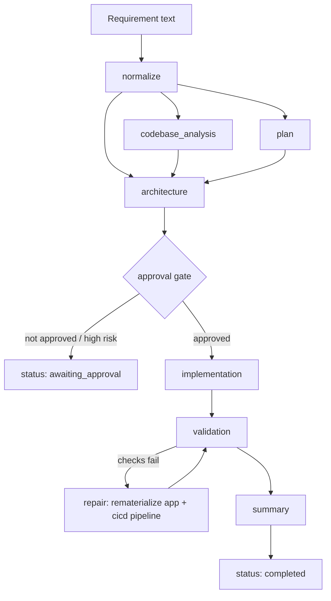

# Architecture notes

## Workflow

The workflow is deliberately small, but it follows the same shape as a larger agentic system:

```text
Requirement -> normalization -> task plan -> architecture -> approval gate
                                                             |
                                                             v
                                            implementation artifacts -> validation -> summary
```

Each task declares the tasks it depends on. The orchestrator only starts ready tasks, records a trace entry for every transition, and stops at the approval gate unless a human has approved the proposed assumptions.

### Control flow and dependency graph



`codebase_analysis` and `plan` both depend only on `normalize` and run independently of each other before `architecture` gates on both — this is the "cross-step coordination, not just sequential execution" the assignment asks for: the orchestrator computes a *ready set* every iteration (`orchestrator.py::run`), not a fixed linear list, so independent branches of the graph can be reordered or parallelized without changing task definitions. The `validation -> repair -> validation` loop is the error-handling/recovery path: a failed post-generation check retries once by rematerializing the known-good template rather than shipping a partially-broken result.

## Separation of responsibilities

- `agentic_system.agents` contains functions that produce engineering artifacts, including the deploy pipeline (`generate_cicd_pipeline`). They are deterministic in this demo, which makes reviews repeatable.
- `agentic_system.orchestrator` owns execution order, approval, failure handling, and the trace.
- `agentic_system.materializer` turns artifacts into files on disk (the application, its Dockerfile, its CI/CD workflows) — kept separate from `agents` so "decide what to build" and "write it to disk" can be tested independently.
- `agentic_system.verifier` re-checks what `materializer` wrote (compiles, runs the app's tests, confirms the CI/CD files exist and look valid) so a broken materialization is caught before the run is marked complete.
- `agentic_system.patcher` applies changes to a *real, external* repository — a different, higher-stakes operation than `materializer` writing into the sandboxed `generated/` directory, so it's a separate module with its own gate (see [Guardrails](#guardrails)).
- `agentic_system.prompted_agents` is the one LLM-backed module. It mirrors `agents.normalize_requirement`'s interface exactly, so the orchestrator can swap between them (`use_llm`) without knowing which one it's calling — see its module docstring for the validation rules that keep model output from reaching the approval gate unchecked.
- `url_shortener` is the generated/reference greenfield output. Keeping it separate prevents the workflow engine and the product code from becoming coupled. Its own architecture — deployment path, observability, HA/failover — lives with it at [../url_shortener/docs/architecture.md](../url_shortener/docs/architecture.md), not here, since those are properties of the generated app, not the agent.

## Guardrails

The workflow records assumptions and pauses for approval before implementation. The validation step checks for required artifacts rather than allowing a partially generated result to look complete.

Repository writing (`agentic_system.patcher`) has its own, stricter set of guardrails on top of the plan-approval gate, because writing to a real external repository is a fundamentally different risk than materializing into the sandboxed `generated/` directory:

- **Read-only by default.** `plan_patch` only ever computes a diff; `--repository-path` alone never writes anything. Writing requires the separate, explicit `--apply-to-repository` flag — a second gate on top of `--approve`, not a rename of it.
- **A bounded file set, not arbitrary writes.** The exact same file list the sandbox patch preview already declares (`orchestrator._build_sandbox_patch_preview`) is the only set of paths `apply_patch` can ever touch — computed once in `patcher._candidate_files`, so "what we said we'd change" and "what we're allowed to change" can never silently diverge.
- **Automatic backup before every overwrite**, plus a manifest recording which files existed before — so `rollback_patch` can restore updates and remove creations without guessing.
- **LLM-backed interpretation never reaches this gate unchecked either.** `prompted_agents.normalize_requirement` validates every field the model returns before accepting it, and always recomputes `approval_required` from the trusted rule rather than trusting the model's own claim about it — the approval boundary is enforced the same way regardless of which normalizer produced the requirement brief.

## Related docs

Docs about the agent itself:

- [Example scenarios](scenarios/) — greenfield, brownfield, and ambiguous runs with real CLI output.
- [Testing approach](testing-approach.md) — the five validation layers and their known limitations.
- [Hosting the agent](hosting-the-agent.md) — architecture for running the agent itself as a shared, hosted service.
- [Contributing / branching strategy](../CONTRIBUTING.md) — how changes to this repo flow through branches and PRs.

Docs about the generated `url_shortener` app — these live with the app, not here:

- [../url_shortener/docs/architecture.md](../url_shortener/docs/architecture.md) — its deployment path, observability, and HA/failover design.
- [../url_shortener/docs/hosting.md](../url_shortener/docs/hosting.md) — a practical, step-by-step guide to hosting it.
- [../url_shortener/docs/runbook.md](../url_shortener/docs/runbook.md) — its on-call playbook and RCA template.
