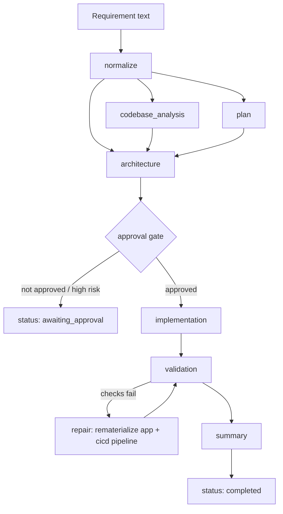

# Architecture notes

## Workflow

The workflow is deliberately small, but it follows the same shape as a larger agentic system:

```text
Requirement -> normalization -> task plan -> architecture -> approval gate
                                                             |
                                                             v
                                            implementation artifacts -> validation -> summary
```

Each task declares the tasks it depends on. The orchestrator only starts ready tasks, records a trace entry for every transition, and stops at the approval gate unless a human has approved the proposed assumptions.

### Control flow and dependency graph



`codebase_analysis` and `plan` both depend only on `normalize` and run independently of each other before `architecture` gates on both — this is the "cross-step coordination, not just sequential execution" the assignment asks for: the orchestrator computes a *ready set* every iteration (`orchestrator.py::run`), not a fixed linear list, so independent branches of the graph can be reordered or parallelized without changing task definitions. The `validation -> repair -> validation` loop is the error-handling/recovery path: a failed post-generation check retries once by rematerializing the known-good template rather than shipping a partially-broken result.

## Separation of responsibilities

- `agentic_system.agents` contains functions that produce engineering artifacts, including the deploy pipeline (`generate_cicd_pipeline`). They are deterministic in this demo, which makes reviews repeatable.
- `agentic_system.orchestrator` owns execution order, approval, failure handling, and the trace.
- `agentic_system.materializer` turns artifacts into files on disk (the application, its Dockerfile, its CI/CD workflows) — kept separate from `agents` so "decide what to build" and "write it to disk" can be tested independently.
- `agentic_system.verifier` re-checks what `materializer` wrote (compiles, runs the app's tests, confirms the CI/CD files exist and look valid) so a broken materialization is caught before the run is marked complete.
- `agentic_system.patcher` applies changes to a *real, external* repository — a different, higher-stakes operation than `materializer` writing into the sandboxed `generated/` directory, so it's a separate module with its own gate (see [Guardrails](#guardrails)).
- `agentic_system.prompted_agents` is the one LLM-backed module. It mirrors `agents.normalize_requirement`'s interface exactly, so the orchestrator can swap between them (`use_llm`) without knowing which one it's calling — see its module docstring for the validation rules that keep model output from reaching the approval gate unchecked.
- `url_shortener` is the generated/reference greenfield output. Keeping it separate prevents the workflow engine and the product code from becoming coupled.

## URL-shortener deployment path

The local reference service uses SQLite because it requires no setup. A production version would use PostgreSQL for links, Redis as a cache-aside lookup layer, and a queue plus worker for click analytics. Redirects should remain fast even if the analytics pipeline is delayed, so counts are eventually consistent.

## Observability

`url_shortener` exposes the three signals an on-call engineer needs to answer "is it up, is it healthy, and why":

- **Structured logs** — every request is logged as one JSON line (`request_id`, `method`, `path` [route template, not the raw URL, to keep cardinality bounded], `status`, `duration_ms`) via the `observability_middleware` in `url_shortener/app.py`. JSON-per-line is directly ingestible by Splunk/ELK/Datadog log pipelines without a parsing rule.
- **Metrics** — `GET /metrics` exposes Prometheus text format: `url_shortener_requests_total` (by method/path/status), `url_shortener_request_duration_seconds` (a histogram, for p50/p95/p99 latency and SLO burn-rate alerts), `url_shortener_links_created_total`, and `url_shortener_redirects_total{result=success|not_found}`. Point a Prometheus scrape config or a Grafana Agent at this endpoint; the histogram buckets are the default `prometheus_client` buckets, tunable once real traffic shows where the interesting latency band is.
- **Correlation IDs** — every response carries `X-Request-ID` (propagated from the caller's own header if present, so a request can be traced end-to-end across a future gateway/service boundary).

## High availability and failover

The reference service is intentionally single-node for local review, but the design keeps HA additive rather than requiring a rewrite:

- **Liveness vs. readiness are separated on purpose.** `GET /health` only proves the process is scheduling requests (safe for a container orchestrator to use for restart decisions). `GET /ready` additionally pings the database (`LinkStore.ping`) and returns 503 if it can't reach it, so a load balancer or orchestrator can pull a node out of rotation *before* it serves failed requests — the standard signal a Kubernetes `readinessProbe` or an ALB health check expects.
- **Stateless application tier.** The FastAPI process holds no in-memory session state; all state is in the store. That means the app tier can run active-active behind a load balancer today — the only shared-state dependency is the database.
- **Data tier is the actual HA boundary.** SQLite is a single-writer, single-file store and is *not* the HA-capable piece; it's a stand-in for the production target: PostgreSQL with a synchronous standby (or a managed multi-AZ instance) for the link table, plus Redis for the cache-aside redirect path. Promoting a standby to primary on failure is the failover event; because the app tier is stateless, failover is transparent to it beyond a reconnect.
- **Multi-region posture.** With Postgres/Redis swapped in, an active-active multi-region deployment reduces to: region-local read replicas for redirect lookups (redirects are latency-sensitive and read-heavy), writes routed to the current primary region, and analytics decoupled onto a queue so a regional blip in the analytics worker never blocks the redirect path (this is already modeled today: click recording never blocks the 302 response).
- **Graceful degradation over hard failure.** Analytics are explicitly eventually consistent (see `docs/architecture.md`'s deployment note) so a slow or down analytics path degrades dashboard freshness, not redirect availability — the failure mode that matters least is allowed to fail first.

## Guardrails

The workflow records assumptions and pauses for approval before implementation. The validation step checks for required artifacts rather than allowing a partially generated result to look complete.

Repository writing (`agentic_system.patcher`) has its own, stricter set of guardrails on top of the plan-approval gate, because writing to a real external repository is a fundamentally different risk than materializing into the sandboxed `generated/` directory:

- **Read-only by default.** `plan_patch` only ever computes a diff; `--repository-path` alone never writes anything. Writing requires the separate, explicit `--apply-to-repository` flag — a second gate on top of `--approve`, not a rename of it.
- **A bounded file set, not arbitrary writes.** The exact same file list the sandbox patch preview already declares (`orchestrator._build_sandbox_patch_preview`) is the only set of paths `apply_patch` can ever touch — computed once in `patcher._candidate_files`, so "what we said we'd change" and "what we're allowed to change" can never silently diverge.
- **Automatic backup before every overwrite**, plus a manifest recording which files existed before — so `rollback_patch` can restore updates and remove creations without guessing.
- **LLM-backed interpretation never reaches this gate unchecked either.** `prompted_agents.normalize_requirement` validates every field the model returns before accepting it, and always recomputes `approval_required` from the trusted rule rather than trusting the model's own claim about it — the approval boundary is enforced the same way regardless of which normalizer produced the requirement brief.

## Related docs

- [Example scenarios](scenarios/) — greenfield, brownfield, and ambiguous runs with real CLI output.
- [Testing approach](testing-approach.md) — the five validation layers and their known limitations.
- [Operational runbook](runbook.md) — on-call playbook and RCA template for the generated service.
- [Hosting the agent](hosting-the-agent.md) — architecture for running the agent itself as a shared, hosted service.
- [Hosting the generated app](hosting-the-generated-app.md) — a practical guide to actually hosting the URL shortener.
- [Contributing / branching strategy](../CONTRIBUTING.md) — how changes to this repo flow through branches and PRs.
