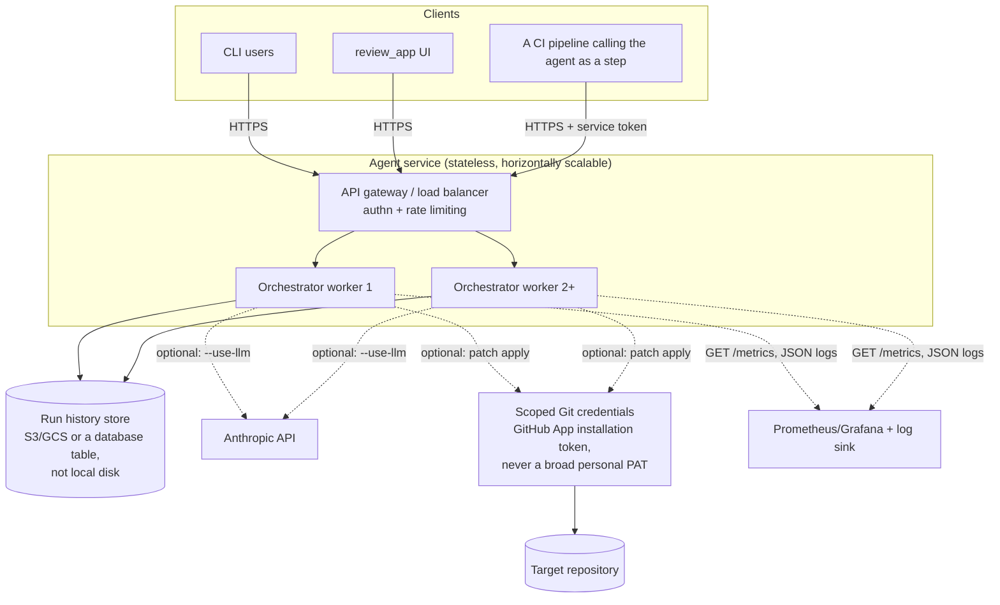

# Hosting the agent itself

The default way to use `agentic_system` is local: clone, `pip install`, run the CLI or the local review UI. This doc is for a different question — what would it take to run the *agent* as a shared, always-on service, so a team calls it instead of everyone running it on their own machine. It's the counterpart to [../url_shortener/docs/hosting.md](../url_shortener/docs/hosting.md), which is about hosting the *software the agent builds*, not the agent.

## Why this is a different problem than hosting the generated app

The generated URL shortener is a normal stateless web service — the hosting playbook for it is standard. The agent is not quite that, for two reasons specific to what it does:

1. **It can write to disk and to real Git repositories** (`agentic_system.materializer`, `agentic_system.patcher`). A hosted, multi-user version of this is handling a genuinely sensitive capability — this needs to be designed for from the start, not bolted on.
2. **It can call an LLM** (`agentic_system.prompted_agents`, opt-in via `--use-llm`). That means an API key, a per-request cost, and a new external failure mode (the provider being slow or down) that a purely local CLI run never had to think about.

## Target architecture

## Packaging

`agentic_system.review_app` is already a FastAPI app — the same Dockerfile pattern used for `url_shortener` (see [../url_shortener/docs/hosting.md](../url_shortener/docs/hosting.md)) applies directly: install the package, `CMD ["uvicorn", "agentic_system.review_app:app", "--host", "0.0.0.0", "--port", "8001"]`. The CLI path (`agentic_system.cli`) can run the same image as a one-off container invocation (e.g. a CI step: `docker run <image> python -m agentic_system.cli --requirement "..." --approve`) rather than needing its own separate packaging.

## What has to change from the local design, and why

- **Run history moves off local disk.** Today a run writes `generated/run.json` and `generated/history/latest.json` to the local filesystem (`RunResult.save_history`). A hosted, replicated service can't rely on that — a request routed to worker 2 can't read a file worker 1 wrote. Swap that write for an object-storage put (S3/GCS) or a database row, keyed by a run ID, before this goes multi-instance. This is a small, contained change: `RunResult.save_history` is already the one seam that does this write.
- **Secrets move to a secrets manager.** `ANTHROPIC_API_KEY` for the LLM path and Git credentials for the patcher path never belong in the image or in environment variables set by hand — use the platform's secrets manager (AWS Secrets Manager, GCP Secret Manager, or the hosting platform's built-in equivalent) and inject them at runtime.
- **The patcher needs scoped credentials, not a broad token.** Locally, `agentic_system.patcher` runs against whatever `--repository-path` you point it at, using your own filesystem permissions — there's no separate credential to think about. Hosted and pointed at a real remote Git repository, the write path needs a narrowly-scoped credential: a GitHub App installation token limited to the specific repositories it's allowed to touch, not a personal access token with broad org access. This is the single most security-sensitive design decision in hosting this service — get a second pair of eyes on it before enabling repository writes in a shared deployment.
- **The approval gate needs a real identity behind it.** Locally, `--approve` is trusted because the person typing it and the person accountable for the change are the same person. In a shared service, "approved: true" needs to be tied to an authenticated caller (their SSO identity, an audit-logged action), not just a boolean flag anyone with API access can set — otherwise the approval gate is theater rather than the control it's meant to be.
- **LLM calls need their own resilience story.** `prompted_agents.normalize_requirement` already falls back to the deterministic path on any failure (see [README](../README.md#try-the-interesting-behaviors)) — that behavior is exactly right for a hosted service too, but now it needs a timeout tuned for real latency variance and its own metric (LLM call failure rate, fallback rate) so a degraded provider is visible rather than silently absorbed.

## Observability: the agent's own operational health, not just the app it builds

The generated `url_shortener` service has `/metrics`, structured JSON logs, and correlation IDs (see [Observability](../url_shortener/docs/architecture.md#observability)) — and now the orchestrator does too, via `agentic_system.observability`. Every run through the CLI *or* the review UI goes through `WorkflowOrchestrator.run()`, so both paths update the same metrics automatically:

- `agent_runs_total{status}` — completed / awaiting_approval / failed, so approval-gate friction and failure rate are visible over time, not just per-run.
- `agent_run_duration_seconds` — a histogram of total run duration.
- `agent_task_duration_seconds{task}` — a histogram per task (`normalize`, `codebase_analysis`, `architecture`, `implementation`, `validation`, ...), so a regression in one stage is visible instead of only "the whole run got slower." In practice `validation` is the slow one today — it shells out to compile and run the materialized app's real test suite — which is exactly the kind of thing this metric is for.
- `agent_llm_fallback_total{reason}` — every time `--use-llm` was requested but fell back to the deterministic path, split by `no_credentials` vs `call_or_parse_error` — the signal that tells you whether the LLM path is actually healthy, not just enabled.
- `agent_patch_apply_total{outcome}` — `applied` or `no_changes`, from `patcher.apply_patch` directly so it fires regardless of caller. Rollbacks are logged (`patch_rolled_back`) but not yet counted as a separate metric — rare and manual enough today that an audit-log line covers it; add a counter if rollback frequency ever becomes worth alerting on.

`GET /metrics` on `agentic_system.review_app` (the same app the packaging section below containerizes) exposes all of it in Prometheus text format — that's the live scrape point once the agent runs as a persistent service rather than a one-shot CLI. For the CLI's one-shot invocations, the structured JSON logs (`agentic_system` logger, one line per task and per run) are the primary observability mechanism instead — a fresh process can't meaningfully expose a running Counter total for anyone to scrape between invocations, so log aggregation is the correct mechanism there, not a `/metrics` snapshot file.

What's still missing for a real hosted deployment: metrics don't yet aggregate *across* replicas (each worker's `/metrics` is only that worker's in-process counters — a real deployment needs Prometheus federation or a shared registry), and there's no alerting wired to any of this yet, just the raw signal.

## CI/CD for the agent service itself

This reuses the same pattern already built for the agent's own tool pipeline (`.github/workflows/ci.yml` / `cd.yml` — see the [README](../README.md#github-actions-cicd)), extended with an actual deploy step at the end of `cd.yml`: build the image, push it to a registry, then deploy to whichever platform hosts it (the same platform menu as [../url_shortener/docs/hosting.md](../url_shortener/docs/hosting.md) applies — Render/Fly/Railway/ECS all support "deploy this image" as a CD step). The existing CI quality gates (`ruff`, `bandit`, `pip-audit`) matter more here than for the generated app, precisely because this service is the one with repository-write and LLM-call capabilities — a dependency vulnerability or a lint-masked bug here has a larger blast radius than one in the demo app it produces.
