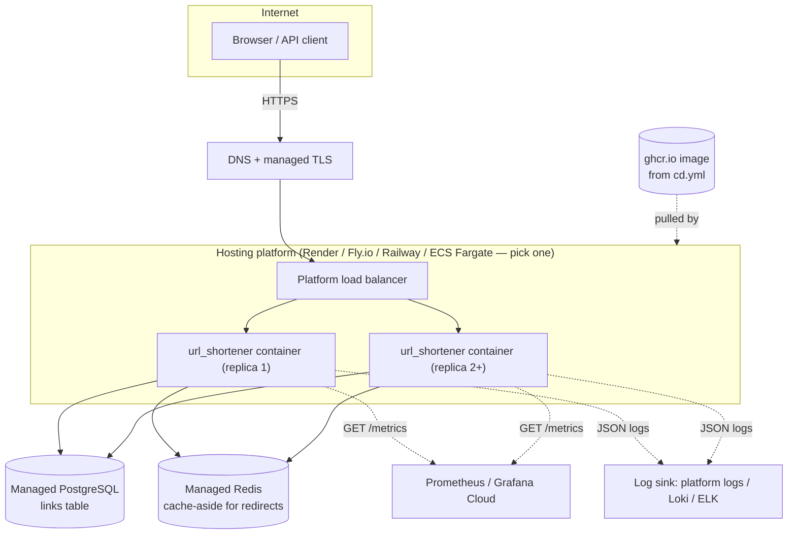

# Hosting the generated app: a practical guide

You have a working URL shortener (`url_shortener/`, or a copy of it materialized into `generated/apps/url_shortener/`, or patched directly into your own repository by `agentic_system.patcher` — see the [README](../README.md#everyday-commands)). This is the "now what" doc: how to actually put it somewhere reachable, safely, without guessing.

## What you already have

- A `Dockerfile` (generated alongside the app — see `agentic_system.materializer.render_cicd_files`) that builds a runnable image.
- A CD pipeline (`.github/workflows/cd.yml` inside the generated app) that already builds that image and pushes it to `ghcr.io` on every successful CI run — see [CI/CD for the generated software](../README.md#github-actions-cicd).
- Health endpoints built for exactly this purpose: `GET /health` (liveness) and `GET /ready` (readiness, checks the database) — see [Observability](architecture.md#observability).

So the image-building half of "deploy this" is already automated. What's left is: where does that image actually run, and what does it talk to.

## The one thing to fix before you host this for real

**The app as generated uses SQLite on local disk.** Most container hosting platforms give you an *ephemeral* filesystem — every redeploy, restart, or scale-up event can wipe it. Deploy the Dockerfile as-is today and your short links will vanish on the next deploy. This isn't a hosting-config problem you can fix with a setting; it's a code change: `url_shortener/store.py`'s `LinkStore` needs a Postgres-backed implementation before this goes anywhere permanent. Everything below assumes that swap has happened (or you're fine with a single always-on instance with a persistent volume as a stopgap — see the note at the end).

## Target architecture

Nothing here is exotic — it's the smallest shape that gets you real availability (2+ replicas), a real health check the platform actually uses (`/ready`), and the observability you already built somewhere it's actually collected.

## Step by step (using Render as the concrete example)

Render is the pick here because it's the least setup for what you have: it deploys straight from a container image, gives you managed Postgres with one click, and terminates TLS on a custom domain for free. Fly.io and Railway are equally valid if you'd rather use their CLI-driven flow instead — the steps below map onto either with minor naming differences.

1. **Confirm the image builds and lands in GHCR.** This already happens automatically — push to `main`, let `ci.yml` pass, let `cd.yml` build and push. Confirm by checking the Packages tab on the GitHub repo.
2. **Create a managed Postgres instance** on your chosen platform. Note the connection string — you'll pass it in as an environment variable, never bake it into the image or commit it.
3. **Create a Redis instance** (same platform, or a separate provider like Upstash) for the cache-aside redirect lookup described in [docs/architecture.md](architecture.md#url-shortener-deployment-path).
4. **Create the web service**, pointing it at the GHCR image (`ghcr.io/<owner>/<repo>-url-shortener:latest` or a specific tag/SHA for a reproducible deploy — prefer the SHA tag in production so "what's running" is never ambiguous).
5. **Set environment variables** for the database and cache connection strings, and anything else the Postgres-backed store needs. Never put secrets in the Dockerfile or in git — every platform above has a secrets/env-var UI for exactly this.
6. **Point the health checks at the right paths.** Configure the platform's liveness check against `/health` and readiness/startup check against `/ready` — this is precisely why those two are separate endpoints: liveness restarts a hung process, readiness controls whether traffic is routed to it at all (see [Observability](architecture.md#observability) for why that distinction matters).
7. **Set replica count to 2 or more.** The app is stateless (no in-memory session state — see [High availability and failover](architecture.md#high-availability-and-failover)), so this is a checkbox, not a redesign.
8. **Attach a custom domain and TLS.** Every platform above provisions a managed certificate automatically once you point DNS at it — no manual cert handling needed.
9. **Point monitoring at `/metrics`.** A free Grafana Cloud or hosted Prometheus instance can scrape this endpoint directly; import a basic dashboard for `url_shortener_requests_total`, `url_shortener_request_duration_seconds`, and `url_shortener_redirects_total`.
10. **Verify a real deploy**: hit `/ready` from outside, create a link, hit `/{code}`, confirm the redirect and the click count. Then intentionally trigger a redeploy and confirm existing links still resolve — that's your proof the Postgres swap actually worked and you're not silently back on ephemeral SQLite.

## If you just want it running today, imperfectly

A single always-on instance with a persistent disk volume (most platforms offer this) keeps SQLite working without the Postgres migration — you lose horizontal scaling and true HA, but you get something real and reachable fast. Be explicit with anyone using it that this is a single point of failure, and treat the Postgres swap as the very next thing to do, not a someday item — [docs/architecture.md](architecture.md#high-availability-and-failover) already documents why.

## Cost shape, not exact numbers

Prices change and vary by platform, so treat this as relative sizing, not a quote: a single small web-service instance plus a small managed Postgres plus a small Redis is typically in the "free tier or low tens of dollars a month" range for a hobby/demo-scale deployment on any of the platforms above; the jump to real production traffic (multiple regions, larger Postgres, dedicated Redis) is where costs actually start to matter and is worth a proper estimate against your specific platform's pricing page before committing.
